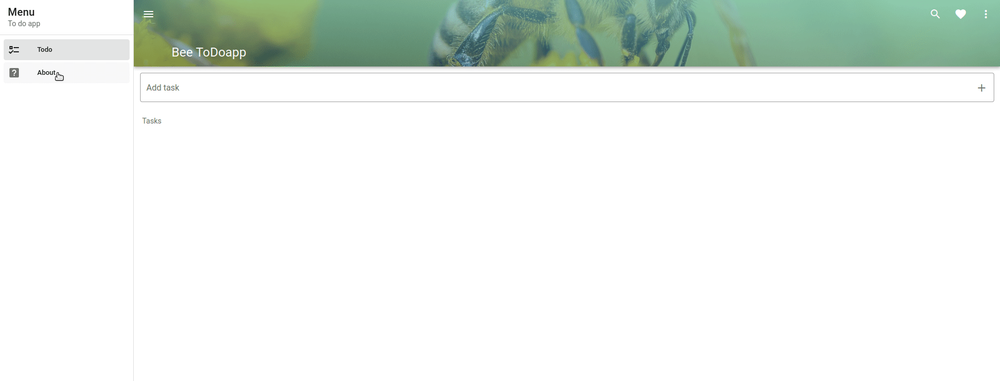

# TO DO app

Simple 'Todo app' written in Vue js and Vuetify.
Functionalities:
- adding and deleting tasks
- marking as done or not done





## Run the application 

 1. **Locally**:

Download the repo locally

Project setup
```
npm install
```

Compiles and hot-reloads for development
```
npm run serve
```

Compiles and minifies for production
```
npm run build
```

2. **With docker ( easier )**:

Download the repo locally

Run project in development environment
```
docker-compose up --build
```

